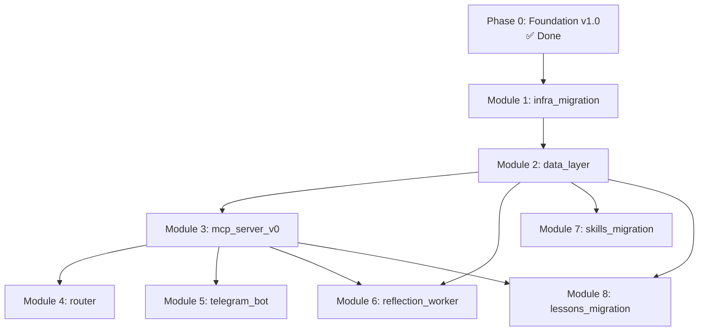

# pretel-os — Project Plan

**Status:** Foundation complete (v1.0), entering build phase
**Owner:** Alfredo Pretel Vargas
**Last updated:** 2026-04-19
**Location in repo:** `/plan.md` (root level, alongside CONSTITUTION and tasks.md)

This document is the project-wide execution plan. It sits above per-module specs and describes what we're building, in what order, with what dependencies, and how we know we're done. For per-module specs see `specs/{module}/`. For the rules of the road see `CONSTITUTION.md`. For the per-turn operating manual see `tasks.md`.

---

## 1. Purpose of this document

Three audiences, one plan:

1. **Future-you opening a new chat after a break.** First thing you read is `SESSION_RESTORE.md`. It points here for global state. This document tells you where the project is, what's next, and what depends on what.
2. **Any LLM Claude/GPT/Gemini being brought in mid-project.** This is the map they need to reason about your next move without reconstructing 3 months of decisions.
3. **You before shipping code.** Before starting any module, read that module's entry below. It will tell you what must be true before you start, what must be true when you finish, and what's downstream.

This document does not contain estimates in time units. Time-to-complete is never relevant here — only ordering and done-when criteria. Mark a task done when its acceptance criteria pass. Period.

---

## 2. Project state snapshot

### 2.1 What exists now

**Foundation documents (v1.0) — ready to commit:**
- `CONSTITUTION.md` — 44 immutable rules, 5 context layers, 4 workers, source-priority regime, degraded-mode contracts
- `PROJECT_FOUNDATION.md` — 8-module roadmap, 19 ADRs, 8 productized services, doc registry, ideas backlog seeded with 12 items
- `DATA_MODEL.md` — 21 tables total (16 Phase-1 MVP + 5 Phase-2), partitioned log tables, all functions and triggers
- `INTEGRATIONS.md` — 10 external/internal integrations, MCP shared-secret required from Phase 1, UptimeRobot external monitoring
- `LESSONS_LEARNED.md` — process document + 10 seed lessons + migration plan for 89 existing lessons

**Audit trail:**
- `CHANGELOG_AUDIT_PASS_3.md` — 19 audit items resolved across 4 priority buckets
- `AUDIT_PROMPT_GPT.md` and `AUDIT_PROMPT_GEMINI.md` — reusable audit prompts for future passes

**Infrastructure already operational (will be migrated, not rebuilt):**
- Vivobook S15 OLED running WSL Ubuntu with: n8n in Docker, Postgres 16, LiteLLM proxy port 4000, Forge pipeline (8-phase)
- Tailscale mesh: Vivobook (`pretel-laptop`, 100.80.39.23) + Asus Rock
- IONOS domain `alfredopretelvargas.com`, webmail `support@declassified.shop`
- GitHub repos: `pr3t3l/sdd-system` (templates), `pr3t3l/openclaw-config` (platform docs + lessons YAML)

**Existing skills/workflows to be migrated:**
- VETT framework (methodology)
- SDD process (methodology + 10 templates)
- Forge pipeline (8-phase n8n workflow, operational)
- Declassified pipeline (4-agent methodology)
- Marketing System (product-agnostic)
- Finance System (personal + rental property)
- Scout slides methodology (abstract patterns only)

**Existing knowledge to migrate to DB:**
- 89 lessons in `LL-MASTER.yaml` + `LL-FORGE.yaml`
- Historical project closures (OpenClaw, various Scout tools) — candidates for `projects_indexed`

### 2.2 What does not exist yet

- A running pretel-os MCP server
- The `pretel-os` repo itself (currently in working directory)
- Ubuntu 24.04 Desktop on the Vivobook (still on WSL)
- Any Postgres database specifically for pretel-os (current Postgres serves n8n)
- Any Phase-1 MVP table populated with real data
- The Router, Reflection worker, Dream Engine, Morning Intelligence
- Cloudflare Tunnel to `mcp.alfredopretelvargas.com`
- Any MCP-compatible client connected to pretel-os

### 2.3 Where we are in the plan

- ✅ Phase 0 Foundation
- ✅ Phase 1 Bootstrap (Modules 1, 2, 3)
- ✅ Phase 2 Intelligence — Module 4 Router COMPLETE (2026-04-29, tag candidate `module-4-complete` on bf3807e):
  - ✅ M4 Phase A Classifier (complete 2026-04-28)
  - ✅ Module 0.X Knowledge Architecture (tag `module-0x-complete`, 2026-04-29):
    - ✅ Phase A Schema migrations (7 migrations applied 2026-04-28: 0024-0029 + 0028a fix)
    - ✅ Phase B SOUL.md (commit `26c7189`, 324 tok)
    - ✅ Phase C MCP tools (18 — `best_practice_rollback` added by C.5.5 split)
    - ✅ Phase D Tests (commit `59127aa`, 47 tests, coverage ≥80% per file)
    - ✅ Phase E Layer loader contract + docs (tag `module-0x-complete`)
  - ✅ M4 Phase B Layer Loader (complete 2026-04-29, tag candidate `phase-b-complete` on 97a67d6)
  - ✅ M4 Phase C Invariant detection (complete 2026-04-29, tag candidate `phase-c-complete` on 7b6f926)
  - ✅ M4 Phase D + E Telemetry + orchestrator + fallback (complete 2026-04-29, tag candidates `phase-e-complete` on c5e1f11 / `phase-d-complete` on 8bda98d)
  - ✅ M4.T9 Exit gate + runbook (complete 2026-04-29 on bf3807e)
  - 🔄 M4 Phase F Tuning (post-30-day, ongoing — observational, no gate; queries in `runbooks/router_tuning.md`)
- ✅ Module 5 telegram_bot COMPLETE (2026-04-29, tag `module-5-complete`). 7 commands + voice handler + session tracking; unblocked M4 D.2 Q8.
- 🔄 Module 6 reflection_worker (outputs feed M5's `/review_pending` + `/cross_poll_review`)
- 🔄 **Module 7 skills_migration IN PROGRESS** — driven by per-phase operator briefs ahead of formal SDD trinity:
  - ✅ M7.A — `skills/sdd.md` + `skills/vett.md` (org-agnostic) + Scout L2 overlay + bucket README (commit `3a41d7f`, 2026-04-29). SQL fallback for `tools_catalog` registration: `migrations/0032_seed_skills_sdd_vett.sql` (NOT yet applied — see Module 7 in `tasks.md` for the open follow-up).
  - ✅ M7.B — `create_project` MCP tool + live `projects` registry (migration 0033) + router `unknown_project` hint (commit `fbe3a66`, 2026-04-30). 8/8 slow tests green. mypy clean.
  - ⏳ M7.C — scope TBD at next kickoff. Candidates: migrate 5 remaining skills, write 3 new skills, apply 0032, ship `runbooks/module_7_skills.md`.
- ⏸️ Module 8 lessons_migration

---

## 3. Directory structure (target)

When committing to `pr3t3l/pretel-os`, the repo looks like this:

```
pretel-os/
├── CONSTITUTION.md              ← Immutable rules (includes AI agent rules)
├── plan.md                      ← This file (project-wide plan)
├── tasks.md                     ← Per-module granular tasks
├── SESSION_RESTORE.md           ← First file to read when opening any new chat
├── README.md                    ← Repo entry point, links to everything
│
├── docs/
│   ├── PROJECT_FOUNDATION.md    ← Vision, stack, roadmap, decisions, doc registry
│   ├── DATA_MODEL.md            ← All database/collection schemas
│   ├── INTEGRATIONS.md          ← External APIs, endpoints, limits, costs
│   └── LESSONS_LEARNED.md       ← Process doc + seed lessons
│
├── specs/
│   ├── infra_migration/         ← Module 1
│   │   ├── spec.md              ← What to build and why
│   │   ├── plan.md              ← How to build it (phases + gates)
│   │   └── tasks.md             ← Atomic tasks with "done when"
│   ├── data_layer/              ← Module 2
│   ├── mcp_server_v0/           ← Module 3
│   ├── router/                  ← Module 4
│   ├── telegram_bot/            ← Module 5
│   ├── reflection_worker/       ← Module 6
│   ├── skills_migration/        ← Module 7
│   └── lessons_migration/       ← Module 8
│
├── identity.md                  ← L0 context, operator identity
├── AGENTS.md                    ← Entry point for any LLM reading the repo
│
├── buckets/
│   ├── personal/README.md
│   ├── business/README.md
│   └── scout/README.md
│
├── skills/
│   └── *.md                     ← Migrated + new skills
│
├── templates/                   ← SDD templates (copied from pr3t3l/sdd-system)
│
├── src/                         ← Code
│   ├── mcp_server/              ← FastMCP application
│   ├── workers/                 ← reflection, dream_engine, morning_intel, auto_index
│   ├── telegram_bot/            ← python-telegram-bot app
│   └── shared/                  ← common utilities
│
├── migrations/                  ← Postgres schema migrations (numbered, forward-only)
│
├── infra/
│   ├── systemd/                 ← unit files for mcp_server, bot, workers
│   ├── hooks/                   ← pre-commit hooks (token budget, secrets scan)
│   ├── backup/                  ← pg_backup.sh, rclone config
│   ├── monitoring/              ← health check scripts
│   └── timeouts.yaml            ← declared timeouts per CONSTITUTION §8.44
│
├── exports/
│   └── lessons_YYYYMMDD.yaml    ← Weekly git export of lessons (by Dream Engine)
│
├── runbooks/                    ← Operational procedures (emerge per module)
│
├── .env.pretel_os.example       ← Credentials template (real file outside repo)
└── .github/
    └── workflows/               ← CI for pre-commit validation
```

**Foundation docs location note:** The current 5 foundation docs (CONSTITUTION, PROJECT_FOUNDATION, DATA_MODEL, INTEGRATIONS, LESSONS_LEARNED) reference each other using short names like `DATA_MODEL §2.1`. When you move them to `docs/`, these references stay valid — search-and-replace is not required. The filenames are unique in the repo.

---

## 4. Module dependency graph

All 8 modules with their hard dependencies. A module cannot start until every dependency has its exit gate passed.

```
Module 1: infra_migration
  └─ depends on: foundation v1.0 committed
  └─ unblocks: Module 2

Module 2: data_layer
  └─ depends on: Module 1 (Ubuntu + Postgres + Docker running)
  └─ unblocks: Module 3, Module 6, Module 7, Module 8

Module 3: mcp_server_v0
  └─ depends on: Module 2 (empty DB + pgvector functional)
  └─ unblocks: Module 4, Module 5, Module 6

Module 4: router
  └─ depends on: Module 3 (MCP server + minimum tool set)
  └─ unblocks: production readiness of Claude.ai + Claude Code + Claude mobile

Module 5: telegram_bot
  └─ depends on: Module 3 (MCP server for save_lesson etc.)
  └─ unblocks: mobile capture, review workflows

Module 6: reflection_worker
  └─ depends on: Module 3 (MCP), Module 2 (reflection_pending table)
  └─ unblocks: automatic lesson extraction

Module 7: skills_migration
  └─ depends on: Module 2 (tools_catalog table + embeddings functional)
  └─ unblocks: L3 skill retrieval

Module 8: lessons_migration
  └─ depends on: Module 2 (lessons table), Module 3 (save_lesson tool for bulk)
  └─ unblocks: L4 retrieval with real corpus
```

**Dependency graph as Mermaid** (render in any Markdown viewer that supports it):



**Parallelizable opportunities** (after their deps are met):

- After Module 3 ships: M4 (router), M5 (telegram bot), M7 (skills migration) can progress in parallel — they don't conflict.
- M6 (reflection) is safest after M4 (router) because reflection calls the router to classify for context, but technically can start after M3.
- M8 (lessons migration) should come after M7 (skills migration) — skills register tools_catalog entries that lessons will reference via `related_tools`.

**Critical path:** M1 → M2 → M3 → M4. Everything else can fork after M3.

---

## 5. Phases and gates

### Phase 0 — Foundation (DONE)

**Gate to exit Phase 0 (all required):**
- [x] CONSTITUTION.md v4 complete and audited
- [x] PROJECT_FOUNDATION.md v3 complete
- [x] DATA_MODEL.md v3 complete (21 tables fully specified)
- [x] INTEGRATIONS.md v2 complete
- [x] LESSONS_LEARNED.md v1 complete
- [x] CHANGELOG_AUDIT_PASS_3.md complete
- [ ] All above committed to `pr3t3l/pretel-os` repo and tagged `foundation-v1.0` ← **CURRENT TOP OF STACK**

This final checkbox is the transition point. Once committed, Phase 0 is sealed and Phase 1 begins.

### Phase 1 — Bootstrap (Modules 1–3)

**Goal:** A running, reachable, authenticated MCP server backed by Postgres, on a proper Ubuntu server, with the minimum tool set to be useful.

**Gate to exit Phase 1 (all required):**
- Module 1 exit gate passed: Ubuntu 24.04 Desktop operational on Vivobook, WSL retired, all prior services migrated and verified
- Module 2 exit gate passed: All 16 Phase-1 tables created with indexes and functions, pgvector operational, schema_migrations log populated
- Module 3 exit gate passed: FastMCP server serves requests at `https://mcp.alfredopretelvargas.com`, shared-secret auth enforced, minimum tool set (`get_context`, `search_lessons`, `save_lesson`, `register_skill`, `load_skill`, `tool_search`) verified working from Claude.ai web AND Claude Code

**What you can do at end of Phase 1:** Claude.ai connects to pretel-os. You can manually save a lesson via `save_lesson` and retrieve it via `search_lessons`. No routing intelligence yet — just the substrate.

### Phase 2 — Intelligence (Modules 4–6)

**Goal:** Automated context assembly (Router), multi-interface capture (Telegram), passive learning (Reflection).

**Gate to exit Phase 2 (all required):**
- Module 4 exit gate passed: `get_context()` correctly classifies bucket/project/skill/complexity and returns properly-budgeted L0-L4 bundle. Telemetry in `routing_logs` for every turn.
- Module 5 exit gate passed: Telegram bot operational with commands `/save`, `/review_pending`, `/project`, `/status`, voice note → `save_lesson`.
- Module 6 exit gate passed: Reflection worker fires on event triggers, generates lesson proposals, writes to `lessons` with `status='pending_review'`.

**What you can do at end of Phase 2:** System learns from your sessions without you triggering anything. Morning capture via Telegram voice. Weekly review of pending lessons.

### Phase 3 — Knowledge loading (Modules 7–8)

**Goal:** The accumulated knowledge from OpenClaw era is now queryable.

**Gate to exit Phase 3 (all required):**
- Module 7 exit gate passed: 10 skills registered in `tools_catalog` with embeddings. `load_skill("vett")` returns full methodology. Test queries from each bucket surface right skill in top-3.
- Module 8 exit gate passed: 75-89 historical lessons migrated, deduplicated, embedded, verified. Test query for known past issue returns correct lesson in top-3.

**What you can do at end of Phase 3:** Full pretel-os as designed. RAG works against real corpus. Cross-pollination active. Ready for real freelance clients.

### Phase 4 — Productization (future, not in this plan)

Not scoped here. Triggered when revenue covers 3x cloud migration cost per ADR-014. Will include:
- Migration to Supabase Pro
- Multi-tenant scoping tightening (Balde 3 items hardened further)
- Managed hosting with redundant ingress
- First productized services going live

This phase gets its own `plan.md` when we reach it.

---

## 6. Per-module entry summaries

These are one-page summaries. Full specs live at `specs/{module}/spec.md` (written at the start of each module, not before).

### Module 1: `infra_migration`

**One-line summary:** Reinstall Vivobook with Ubuntu 24.04 Desktop. Migrate Forge pipeline, n8n, Postgres 16, LiteLLM from WSL to the new host. Retire WSL.

**Why:** Current WSL setup was a stopgap. Ubuntu Desktop as server is more stable, easier to maintain, and required for systemd-managed services in Module 3+.

**Depends on:** Foundation v1.0 committed.

**Unblocks:** Everything else. This is the bedrock.

**Done when:**
- Vivobook boots directly into Ubuntu 24.04 Desktop (WSL retired)
- All prior services (n8n, Postgres 16, LiteLLM, Tailscale, cloudflared) operational on the new OS
- Forge pipeline runs end-to-end on the new setup (regression-free)
- Backup script per DATA_MODEL §10.1 tested with a verified restore drill
- A runbook at `runbooks/module_1_infra_migration.md` exists with the exact steps taken (for future re-migrations)

**Risk notes:**
- Data loss during OS reinstall. Mitigation: full backup of WSL volumes + Postgres dump to external drive before touching anything, verified by partial restore.
- Tailscale re-auth needs browser. Have the Asus Rock ready for re-auth flow.
- Forge may have undocumented WSL-specific path dependencies. First run after migration will expose them.

### Module 2: `data_layer`

**One-line summary:** Create the pretel-os Postgres database with all 16 Phase-1 tables, indexes, functions, triggers, partitions, and seed data (scout_denylist seeds, control_registry seeds).

**Why:** Nothing else can ship without the schema. This is pure DDL execution following `DATA_MODEL.md` exactly.

**Depends on:** Module 1.

**Unblocks:** Modules 3, 6, 7, 8.

**Done when:**
- `pretel_os` database exists (separate from the existing n8n DB)
- All 16 Phase-1 tables exist with correct indexes, verified via `\d+ {table}` on each
- All functions (`updated_at` trigger, `recompute_utility_scores`, `archive_low_utility_lessons`, `summarize_old_conversation`, `scout_safety_check`, `archive_dormant_tools`) execute without error against test data
- All triggers (`trg_scout_safety_lessons`, `trg_set_updated_at_*`) fire correctly on manual test inserts
- Monthly partition tables for `routing_logs`, `usage_logs`, `llm_calls` exist for the current month + next month
- `schema_migrations` table populated with 23 forward-only migrations applied
- Seed data loaded: `scout_denylist` (operator-provided patterns), `control_registry` (6 seed controls per DATA_MODEL §5.6)
- A script `infra/db/health_check.py` returns green on the full schema

**Risk notes:**
- pgvector installation on Ubuntu 24.04 — verify version compatibility with Postgres 16.
- HNSW index creation on empty tables is instant but slow with data. Order: create tables, load data, create HNSW indexes last. Migrations should reflect this.
- Partition creation is ongoing maintenance. Dream Engine will own it from Module 6 onwards; for M2 just seed current + next month manually.

### Module 3: `mcp_server_v0`

**One-line summary:** FastMCP server exposing the minimum useful tool set. systemd-managed. Cloudflare Tunnel exposes it at `mcp.alfredopretelvargas.com` with shared-secret auth.

**Why:** The gateway. Without this, no client can interact with pretel-os.

**Depends on:** Module 2.

**Unblocks:** Modules 4, 5, 6, 8.

**Done when:**
- `src/mcp_server/` contains FastMCP app with lazy DB initialization per CONSTITUTION §8.43(a)
- `X-Pretel-Auth` middleware validates on every request (per INTEGRATIONS §11.1)
- Minimum tool set registered: `get_context`, `search_lessons`, `save_lesson`, `register_skill`, `load_skill`, `tool_search` (per PROJECT_FOUNDATION Module 3 spec)
- systemd unit `pretel-os-mcp.service` runs the server, auto-restarts on failure
- cloudflared running as systemd service, tunnel UUID configured, subdomain `mcp.alfredopretelvargas.com` resolves via IONOS CNAME
- UptimeRobot monitor created and pinging `/health` successfully
- Claude.ai connector configured with the shared secret and successfully calls `get_context`
- Claude Code `~/.config/claude/mcp.json` configured and `claude` CLI can call tools
- Smoke test: `save_lesson(...)` inserts a row with `status='pending_review'`, `get_context("test")` returns a sensible bundle even with empty DB
- A runbook at `runbooks/module_3_mcp_server.md` documents deploy, restart, rollback procedures

**Risk notes:**
- FastMCP version stability — pin to exact version.
- Cloudflare Tunnel setup requires browser auth. Do this on a machine where you can see the operator's Google/Cloudflare auth flow.
- Shared secret rotation will break all connected clients until they update. Document rotation procedure as part of the runbook.

### Module 4: `router`

**One-line summary:** The classifier + layer assembler. `get_context(message)` becomes intelligent.

**Why:** Without this, the MCP server is a dumb passthrough. The Router is what makes pretel-os _pretel-os_.

**Depends on:** Module 3.

**Unblocks:** Production use across all clients.

**Done when:**
- Router code in `src/mcp_server/router/` implements the 6 responsibilities per CONSTITUTION §2.2
- Classification via LiteLLM alias `classifier_default` returns `{bucket, project, skill, complexity, needs_lessons}` for test inputs, per CONSTITUTION §5.1 rule 11
- Layer loader respects budgets per CONSTITUTION §2.3 (write-time hook already enforces budgets on commits, but read-time summarization fallback exists)
- Source priority resolution implemented per CONSTITUTION §2.7 (both immutable invariants and ordered regime)
- `routing_logs` populated on every call with all telemetry fields (source_conflicts, over_budget_layers, rag_expected vs rag_executed, etc.)
- Fallback to rule-based classifier when LiteLLM is unreachable; sets `classification_mode='fallback_rules'`
- Smoke tests: query about a known bucket returns that bucket's L1 + relevant L2 + L4 lessons. Query about unknown topic returns L0 + L1 only.
- Per-turn latency under 2 seconds for HIGH complexity (budget target)
- A runbook at `runbooks/module_4_router.md` covers LiteLLM/classifier outages, classification debugging, and budget overruns

**Risk notes:**
- Classifier prompt quality drives everything (provider-agnostic — must work across Gemini/Claude/GPT/Kimi). Invest disproportionate time on this prompt. Keep iteration examples in `tests/router/classification_examples.md`.
- Cache warm-up for Anthropic prompt caching takes a few calls; first-turn latency will be higher than steady-state.
- Budget enforcement at read-time might conflict with write-time hook. Verify: the only read-time summarization should be for entities that slipped through hook (existing before hook was installed).

**Phase A status (2026-04-28):** COMPLETE. Classifier ships with truncation detection, telemetry capture, schema validation, and a live eval suite. See specs/router/ and tests/router/eval_results/.

**Inserted dependency:** Module 0.X Knowledge Architecture must close before Phase B starts. Phase B's layer loader needs to know which tables feed which layer; that mapping is established in M0.X.

### Module 0.X: `knowledge_architecture`

**Position:** Inserted between M4 Phase A and M4 Phase B. Same Phase 2 (Intelligence).

**Why insertion:** During M4 Phase A.6.1 review, the operator caught that the `lessons` table was being used as a catch-all for tasks, decisions, best practices, and personality preferences. Each has different mutability and load semantics. Splitting now (before Phase B specifies what to load into L0–L4) is cheaper than splitting later.

**Scope:** New `tasks`, `operator_preferences`, `router_feedback` tables. Amendment of existing `decisions` table to add scope/cross-bucket/tags/severity columns. New `SOUL.md` workspace file. ~12 new MCP tools. Migration of 4 misclassified `lessons` rows.

**Out of scope:** Reflection worker (M6), Phase B layer loader, replacement of `lessons`.

**Spec:** `specs/module-0x-knowledge-architecture/spec.md` (revised at commit 8a6cf7d, plan ff81538, tasks c4b4649). Per-phase commit chain in `specs/module-0x-knowledge-architecture/tasks.md`.

**Phase A status (2026-04-28):** COMPLETE. 7 migrations applied to production (0024-0029 + 0028a Module 2 trigger fix). 5 ADRs seeded into `decisions`. 4 misclassified `lessons` rows archived with cross-table pointers. Schema audit at `migrations/audit/0029_post_state.md`. Spec drifts caught and corrected inline: §5.4 (request_id text vs uuid), §5.2 (scope DEFAULT 'operational'), §7 (status='archived' since lesson_status enum has no 'superseded'). Phase A close-out commit: `bc4e5df`.

**Phase B-E status:** Pending. T4.B (SOUL.md) is next, then T4.C (MCP tools), T4.D (tests), T4.E (close-out + tag). Per-module atomic detail at `specs/module-0x-knowledge-architecture/tasks.md`; root milestones at `tasks.md` (M0X.T4.B-E).

**Exit gate:** Migration applies cleanly, all new MCP tools registered and callable, mypy --strict clean, integration tests for every tool, the 4 misclassified lessons visible in their proper tables with originals marked archived.

### Module 5: `telegram_bot`

**One-line summary:** python-telegram-bot v21 app. Commands for capture, review, status. Voice notes transcribed and routed through MCP.

**Why:** Mobile capture path. The Morning Intelligence delivery channel. The primary review UX.

**Depends on:** Module 3.

**Unblocks:** Mobile-first workflows. Passive capture.

**Done when:**
- `src/telegram_bot/` contains the bot app
- systemd unit `pretel-os-bot.service` runs it, auto-restarts
- All commands from INTEGRATIONS §8.4 implemented: `/start`, `/save`, `/review_pending`, `/cross_poll_review`, `/morning_brief`, `/reflect`, `/idea`, `/status`, `/project`, `/search_lessons`, `/help`
- Voice notes transcribed (via OpenAI Whisper API or local whisper.cpp — decide at module spec time) and routed to `save_lesson` for review
- `/status` command runs parallel health checks and returns 🟢🟡🔴 summary, cached 60s per INTEGRATIONS §8.4
- Long-polling mode active (Phase 1 default per INTEGRATIONS §8.4); webhook mode ready as feature flag
- Rate limiting respected (handled by python-telegram-bot automatically)
- A runbook at `runbooks/module_5_telegram_bot.md` covers bot registration, token rotation, webhook migration path

**Risk notes:**
- Operator must register bot with BotFather first. Document the exact conversation with BotFather for reproducibility.
- Voice transcription cost. Whisper API is cheap but not free. Evaluate local whisper.cpp on Ubuntu 24.04 — the Vivobook has GPU capacity.

### Module 6: `reflection_worker`

**One-line summary:** Event-triggered LLM call that reads a session transcript and proposes lessons, cross-pollination flags, project state updates.

**Why:** Without this, pretel-os doesn't learn. This is the heartbeat of the system's memory formation.

**Depends on:** Modules 2 (for `reflection_pending`, `conversation_sessions`, `lessons` tables) and 3 (for MCP tools it will call).

**Unblocks:** The passive learning promise.

**Done when:**
- `src/workers/reflection.py` runs as systemd unit triggered by events (task_complete, close_session, idle 10min, turn count 20, session lifespan 60min)
- Per CONSTITUTION §2.6, writes proposals to `lessons` (status=pending_review), `cross_pollination_queue`, `project_state`
- Degraded mode: when Sonnet unreachable, queues payload to `reflection_pending` per DATA_MODEL §4.5
- Tests with synthetic transcripts show sensible proposals (no false positives on trivial exchanges, no missed lessons on real ones)
- Cost per reflection call tracked in `llm_calls` with `purpose='reflection'`, stays under $0.02 per firing at current Sonnet pricing
- A runbook at `runbooks/module_6_reflection.md` covers reflection tuning, false-positive patterns, queue backlog handling

**Risk notes:**
- Prompt engineering for Sonnet. Invest in the system prompt. Keep iteration log in `tests/reflection/examples.md`.
- False positives will spam `lessons_pending_review`. Calibrate early with aggressive threshold tuning.
- Session transcript assembly from `conversation_sessions.transcript_path` must be robust. JSONL append errors corrupt future reflections.

### Module 7: `skills_migration`

**One-line summary:** Port 10 skills to `skills/*.md`, register each in `tools_catalog` with embeddings. Includes 3 new skills: `client_discovery`, `sow_generator`, `mtm_efficiency_audit`.

**Status (2026-04-30):** Phases A and B closed via per-phase operator briefs (no formal SDD trinity yet — flagged as carry-forward). Phase C scope pending.

**Why:** L3 (skill layer) is empty until this runs. The Router has nothing to return for skill-classified queries.

**Depends on:** Module 2.

**Unblocks:** L3 retrieval. Freelance productization (SOW and client discovery are immediately useful).

**Phases shipped so far:**

- **M7.A** (commit `3a41d7f`, 2026-04-29): generic `skills/sdd.md` + `skills/vett.md` (organization-agnostic, with `{the organization}` / `{client_tech_stack}` / `{client_governance_team}` variable bindings); Scout-specific L2 overlay at `buckets/scout/skills/vett_scout_context.md`; rewritten `buckets/scout/README.md`. Migration `0032_seed_skills_sdd_vett.sql` ships the `tools_catalog` upsert (SQL fallback after the MCP `register_skill` session was lost mid-task). **Migration 0032 not yet applied to either DB** — open follow-up.
- **M7.B** (commit `fbe3a66`, 2026-04-30): live `projects` registry table (migration `0033`, distinct from `projects_indexed` which holds closed/archived projects with embeddings); MCP tools `create_project` / `get_project` / `list_projects` in `src/mcp_server/tools/projects.py`; router helper `_check_project_exists()` + `unknown_project` hint in the bundle response when the classifier picks a (bucket, project) with no registry row and no L2 README on disk. 8/8 slow tests green; mypy clean. Service restarted clean.

**Phase C — TBD scope.** Operator picks at next kickoff. Candidates:
1. Migrate the remaining 5 skills (`scout_slides`, `declassified_pipeline`, `forge`, `marketing_system`, `finance_system`) from their source repos.
2. Write the 3 new skills from scratch (`client_discovery`, `sow_generator`, `mtm_efficiency_audit`).
3. Apply `migrations/0032_seed_skills_sdd_vett.sql` and verify `tools_catalog` rows + embeddings for sdd + vett.
4. Ship `runbooks/module_7_skills.md` (how to add a new skill post-migration; required for the exit gate below).

**Done when:**
- All 10 skill files exist in `skills/` (7 migrated: vett ✅, sdd ✅, scout_slides, declassified_pipeline, forge, marketing_system, finance_system; 3 new: client_discovery, sow_generator, mtm_efficiency_audit) — currently 2/10.
- Each skill is under L3 budget (4,000 tokens) — if any exceeds, the pre-commit hook blocks the commit (good signal).
- Each skill registered via `register_skill()` tool with correct `applicable_buckets` metadata. **Currently 0/2 applied** — sdd+vett rows live only in the SQL file at migration 0032, not in any DB.
- Each has embeddings populated (Auto-index worker runs after migration 0032 inserts, or bulk insert via batch embedding).
- Test query for each bucket returns the expected skill in top-3 via `recommend_tools` or `load_skill` by name.
- A runbook at `runbooks/module_7_skills.md` documents how to add a new skill post-migration.

**Risk notes:**
- The 3 new skills (client_discovery, sow_generator, mtm_efficiency_audit) have no prior version. Write them from scratch using patterns from existing skills + Gemini Strategic review descriptions.
- Scout slides skill must not contain employer-identifying content. Pre-commit hook + Scout safety trigger catch this; verify before commit.
- Migration runner `infra/db/migrate.py` has a pre-existing version-format bug (stores `path.stem`, older rows store 4-digit prefix); workaround documented in `LL-INFRA-001`. Applying 0032 should use direct `psql -1 -f` + prefix-only INSERT until the runner is reconciled (`M7.A.fu2` in tasks.md).

### Module 8: `lessons_migration`

**One-line summary:** Migrate 89 existing lessons from `LL-MASTER.yaml` + `LL-FORGE.yaml` to the `lessons` table. Dedupe during migration. Seed `ideas` table with 12 items from Gemini Strategic backlog.

**Why:** L4 is empty until this runs. The system has no historical corpus for RAG.

**Depends on:** Modules 2 (lessons + ideas tables) and 3 (save_lesson tool for bulk via MCP).

**Unblocks:** RAG against real corpus. Cross-pollination across all 89 learnings.

**Done when:**
- Python migration script at `src/workers/migration_yaml_to_db.py` parses both YAMLs
- Each lesson inserted with source=`migration_LL-MASTER` or `migration_LL-FORGE`, `status='pending_review'`
- OpenAI Batch API used for embeddings (50% discount per INTEGRATIONS §3.6)
- Dedup pass runs after embeddings populated. Pairs at similarity ≥ 0.92 flagged for merge review; expected batch around ~10 pairs.
- Operator batch reviews pending lessons via Telegram `/review_pending`, promotes 75-89 to `status='active'`
- Ideas table seeded with 12 items from PROJECT_FOUNDATION §5.2
- Test queries verify retrieval: "n8n batching" returns n8n lessons in top-3, "Scout VBA" returns Scout patterns, "OpenClaw architecture" returns decision lessons
- `MIGRATION_TODO.md` documents any lessons that remain `pending_review` after batch review (for slow cleanup)
- A runbook at `runbooks/module_8_lessons.md` covers re-running the migration if needed and adding future bulk imports

**Risk notes:**
- YAML parsing on lessons with multi-line content. Use `yaml.safe_load` carefully. Test on the full dataset before running.
- Batch API turnaround is up to 24 hours. Trigger overnight, inspect next morning.
- Operator review burden: 75-89 items is a lot to click through. Consider a web UI (Streamlit 50 lines) as a side quest if Telegram `/review_pending` feels tedious at that scale.

---

## 7. Cross-module concerns

Things that span multiple modules and must not be forgotten.

### 7.1 Pre-commit hooks

Install before Module 2 ships (they validate schema changes too):

- `infra/hooks/pre-commit-token-budget.sh` — blocks commits that push a layer file over budget per CONSTITUTION §7.36
- `infra/hooks/pre-commit-scout-safety.sh` — scans for Scout denylist patterns in any file under `buckets/scout/` per CONSTITUTION §3
- `infra/hooks/pre-commit-env-scan.sh` — blocks commits of files matching `*.env*` or containing `sk-ant-` / `sk-proj-` patterns

Configure via `.git/hooks/pre-commit` or use `pre-commit` framework. Document in a `runbooks/pre-commit.md`.

### 7.2 Backup discipline

Even in Phase 0 before data exists, the backup script and restore drill must be tested once. Starting Module 2 with untested backup is a violation waiting to happen. Backup script per DATA_MODEL §10.1; daily via systemd timer.

### 7.3 Cost monitoring

Every module that adds LLM calls (3, 4, 5, 6) populates `llm_calls` per DATA_MODEL §4.3. Before that module's gate closes, verify that a daily query against `llm_calls` shows correct per-purpose cost attribution. Target: stay under $30/month Phase 0-3 per PROJECT_FOUNDATION constraints.

### 7.4 Control registry activation

`control_registry` table gets seeded in Module 2. But the Dream Engine (which reads it and sends overdue alerts) doesn't exist until Module 6. Between those modules, the operator reviews the table manually via psql. Document this gap as a temporary operational cost — not a gap in the design.

### 7.5 UptimeRobot setup

Create the UptimeRobot monitor during Module 3 (the moment `mcp.alfredopretelvargas.com/health` returns 200). Note the account login in the operator's password manager. The monthly uptime report is the `control_registry.uptime_review` evidence artifact.

### 7.6 Identity.md and AGENTS.md

These are L0 content files, load-bearing but not tracked as module deliverables. Write them during Module 3 alongside the MCP server — they're the content the Router will serve as L0.

`identity.md` structure:
- Operator identity (name, location, timezone, language preferences)
- Bucket names and 1-line descriptions
- Tool catalog entries (1-line each, synced by `register_skill`/`register_tool`)
- Immutable invariants summary (references CONSTITUTION §2.7)

`AGENTS.md` structure:
- How to read the pretel-os repo as an LLM
- Reading order: AGENTS.md → CONSTITUTION → plan.md → tasks.md → module-specific if relevant
- The 9 agent rules from CONSTITUTION §9 inlined
- Where to find things (reference to directory structure in §3)

### 7.7 Weekly git export

The Dream Engine (Module 6+) writes `exports/lessons_YYYYMMDD.yaml` every Sunday. Until Module 6 exists, this doesn't run. Don't treat that as a gap — it's expected Phase 1 behavior.

---

## 8. Risk register (project-level)

Risks that span multiple modules. Per-module risks are in each module's spec.

| Risk | Probability | Impact | Mitigation | Owner |
|------|:-----------:|:------:|------------|:-----:|
| Vivobook hardware failure during Phase 1 | Medium | Critical | Full backup before Module 1. Asus Rock failover runbook. Encrypted off-site backup via rclone. | Operator |
| Cloudflare Tunnel unreachable for extended period | Low | High | Tailscale as operator fallback. MCP server has no other public ingress in Phase 1. Accept this gap. | Infrastructure |
| Anthropic price increase ≥ 50% | Low | Medium | `llm_calls` daily cost tracking. Budget alert in Morning Intelligence when daily spend > $1.00. | Operator review |
| OpenAI embeddings model deprecated | Low | High | Migration template in DATA_MODEL §11.5. Constitutional amendment process. Full reindex would cost under $5 at current corpus size. | Future migration |
| Foundation docs drift as implementation reveals gaps | High | Medium | Every module spec can propose CONSTITUTION amendments in its spec.md §6 (constitutional_impact). Amendment process is defined but infrequent. | Per-module |
| Context engineering errors (Router classification quality) | Medium | Medium | Module 4 spec mandates test examples with expected classifications. Iteratively tune classifier prompt; A/B test across LiteLLM aliases when needed. | Module 4 |
| Scout compliance violation via agent-generated content | Low | Critical | Defense in depth: pre-commit hook + MCP tool filter + DB trigger per `scout_denylist`. | Continuous |
| Lesson corpus bloat over time | Medium | Low | Dream Engine archive + dedup rules. Review utility_score distribution quarterly. | Post-Phase 3 |
| Operator burnout / project abandonment | Medium | Critical | This plan and tasks.md designed for stateless resumption. Any chat can pick up. SESSION_RESTORE.md makes re-entry cheap. | Operator |
| Unexpected Scout Motors employment change | Low | High | System is operator-independent of employer. Scout bucket survives as abstracted patterns. Freelance pipeline (Phase 4) is the planned off-ramp. | Operator |

---

## 9. How to resume after a break

If you walk away for any length of time — days, weeks, months — here's the resumption procedure:

1. **Open `SESSION_RESTORE.md` first.** It's small (under 100 lines) and tells you what state you left in and what to say to the next LLM.
2. **Check the last `/status` from the bot (or run it fresh).** Gives you health of all integrations.
3. **Run `git log --oneline -20` in the repo.** Shows the last 20 commits. If foundation commit is the most recent, you're still in Phase 0 transition. If you see module commits, match them to the phase table in §5.
4. **Open `tasks.md` and find the first unchecked `[ ]` item.** That's where you restart.
5. **Read the current module's `specs/{module}/spec.md`** if you're mid-module. That has the full context.
6. **If a long gap (>2 weeks)**, also re-read the `CHANGELOG_AUDIT_PASS_3.md` and the CONSTITUTION section relevant to your current module. Rules may feel unfamiliar after a break.

---

## 10. Definition of "project done"

This plan covers Phases 0-3. pretel-os "done" means all 8 modules have passed their exit gates, Phase 3 is closed, and the Morning Intelligence at 06:00 delivers a useful brief based on real retrieval against real corpus.

After Phase 3 closes, the project continues but in a different mode: steady-state operation, evolution, productization (Phase 4), and scaling. That's not part of this plan. A new `plan.md` (or `plan-v2.md`) will be written for Phase 4 when triggered by revenue-gating per ADR-014.

---

## 11. Non-goals of this plan

Things this plan does not try to do, for clarity:

- **Estimate calendar time.** No hours, days, or weeks anywhere. Modules ship when their gates pass.
- **Sequence operator learning.** You already know the stack. No "first learn Postgres, then..." scaffolding.
- **Prescribe UI choices.** `/review_pending` in Telegram is in the spec; whether a Streamlit side-UI also exists is a module-level call.
- **Cover Phase 4+ (productization).** Scoped for future separate plan.
- **Track costs at line-item granularity.** The `llm_calls` table and per-module risk notes give order-of-magnitude guidance. Precise cost tracking is an operational activity, not a planning artifact.
- **Enforce a particular operator workflow.** The system adapts to your capture and review rhythm. Telegram voice note at 11 PM is as valid as Claude.ai at 7 AM.

---

## 12. Cross-references

- **Rules:** `CONSTITUTION.md`
- **Vision and ADRs:** `docs/PROJECT_FOUNDATION.md`
- **Schema:** `docs/DATA_MODEL.md`
- **External systems:** `docs/INTEGRATIONS.md`
- **Lessons process:** `docs/LESSONS_LEARNED.md`
- **Per-turn tasks:** `tasks.md`
- **Chat resumption:** `SESSION_RESTORE.md`
- **Audit trail:** `CHANGELOG_AUDIT_PASS_3.md`
- **Per-module specs:** `specs/{module}/spec.md` (each written at module start)
- **Runbooks:** `runbooks/{topic}.md` (each written during or after relevant module)

---

**End of plan.md.**

Before reading any module, come back here to understand where it fits. Before writing any code, confirm you're on the right module per the dependency graph in §4. Before claiming a module done, tick every box in that module's "Done when" list.

Nothing is optional. The plan is the plan.
